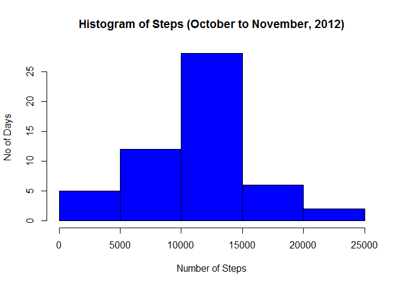
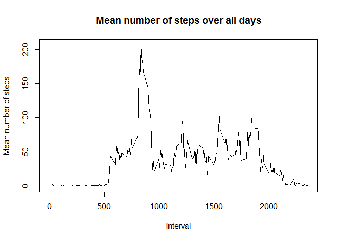
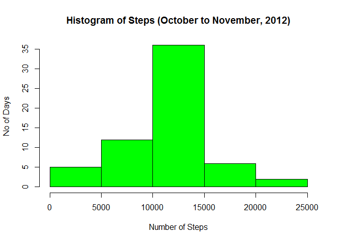
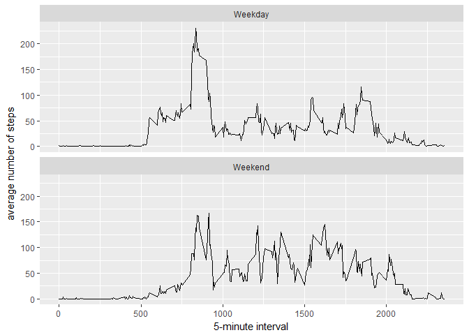

# Reproducible Research Week 2 Peer Assessment 1
Daniel Jones  
30 May 2017  

##1. Loading and pre-processing the data

Show any code that is needed to:

1.Load the data (i.e. read.csv())

2.Process/transform the data (if necessary) into a format suitable for your analysis

To do this, create a directory to hold the data

```r
if(!file.exists("data")){
        dir.create("data")
}
```

Then download and unzip the data

```r
filename<-"./data/repdata_data_activity.zip"

if (!file.exists(filename)){
        fileURL<-"https://d396qusza40orc.cloudfront.net/repdata%2Fdata%2Factivity.zip"
        download.file(fileURL, filename)
        unzip(filename, exdir = "./data")
}
```

Read in data into a data frame. We keep the NA values to support future questions associated with this analysis

```r
activity <- read.csv("./data/activity.csv")
```

##2. What is the mean total number of steps taken per day?

For this part of the assignment, you can ignore the missing values in the dataset.

1.Calculate the total number of steps taken per day. A 'head' of the activitysum dataframe is provide to illustrate what has been produced


```r
activitysum <- aggregate(steps~date, activity, sum)
head(activitysum)
```

```
##         date steps
## 1 2012-10-02   126
## 2 2012-10-03 11352
## 3 2012-10-04 12116
## 4 2012-10-05 13294
## 5 2012-10-06 15420
## 6 2012-10-07 11015
```

2. Make a histogram of the total number of steps taken each day


```r
hist(activitysum$steps, col= "Blue" , 
     main = "Histogram of Steps (October to November, 2012)", 
     xlab = "Number of Steps", 
     ylab = "No of Days")
```

<!-- -->

3.Calculate and report the mean and median of the total number of steps taken per day


```r
summary(activitysum)
```

```
##          date        steps      
##  2012-10-02: 1   Min.   :   41  
##  2012-10-03: 1   1st Qu.: 8841  
##  2012-10-04: 1   Median :10765  
##  2012-10-05: 1   Mean   :10766  
##  2012-10-06: 1   3rd Qu.:13294  
##  2012-10-07: 1   Max.   :21194  
##  (Other)   :47
```
The median number of steps is 10765.

The mean number of steps is 10766.

##3. What is the average daily activity pattern?

1.Make a time series plot (i.e. type = "l") of the 5-minute interval (x-axis) and the average number of steps taken, averaged across all days (y-axis)


```r
intervalmean <- aggregate(steps~interval, activity, mean)
plot(intervalmean$interval, intervalmean$steps, type='l', 
        main="Mean number of steps over all days", xlab="Interval", 
        ylab="Mean number of steps")
```

<!-- -->

2.Which 5-minute interval, on average across all the days in the dataset, contains the maximum number of steps?


```r
intervalmean[which.max(intervalmean$steps),]
```

```
##     interval    steps
## 104      835 206.1698
```

The 5-minute interval that contains the maximum number fo steps is interval 835 with 206 steps.

##4. Imputing missing values

Note that there are a number of days/intervals where there are missing values (coded as NA). The presence of missing days may introduce bias into some calculations or summaries of the data.

1.Calculate and report the total number of missing values in the dataset (i.e. the total number of rows with NAs)


```r
summary(activity)
```

```
##      steps                date          interval     
##  Min.   :  0.00   2012-10-01:  288   Min.   :   0.0  
##  1st Qu.:  0.00   2012-10-02:  288   1st Qu.: 588.8  
##  Median :  0.00   2012-10-03:  288   Median :1177.5  
##  Mean   : 37.38   2012-10-04:  288   Mean   :1177.5  
##  3rd Qu.: 12.00   2012-10-05:  288   3rd Qu.:1766.2  
##  Max.   :806.00   2012-10-06:  288   Max.   :2355.0  
##  NA's   :2304     (Other)   :15840
```

The number of missing values in the activity dataset is ...

2.Devise a strategy for filling in all of the missing values in the dataset. The strategy does not need to be sophisticated. For example, you could use the mean/median for that day, or the mean for that 5-minute interval, etc.

The strategy that has been used to fill in the missing values is to take the mean 5 minute interval calculated previously and add it to the new data frame 'activitynew' where there are NA values.

3.Create a new dataset that is equal to the original dataset but with the missing data filled in.


```r
newactivity<-activity
index<-nrow(newactivity)
for(i in 1:index){
        if (is.na(newactivity[i, "steps"])){
                intervalindex<-newactivity[i, "interval"]
                newactivity[i, "steps"] <- intervalmean[which(intervalmean$interval==
                                                                      intervalindex), "steps"]
        }
        intervalindex<-0
}
```

4.Make a histogram of the total number of steps taken each day and Calculate and report the mean and median total number of steps taken per day. Do these values differ from the estimates from the first part of the assignment? What is the impact of imputing missing data on the estimates of the total daily number of steps?


```r
newactivitysum <- aggregate(steps~date, newactivity, sum)
hist(newactivitysum$steps, col= "Green" , 
     main = "Histogram of Steps (October to November, 2012)", 
     xlab = "Number of Steps", 
     ylab = "No of Days")
```

<!-- -->

```r
summary(newactivitysum)
```

```
##          date        steps      
##  2012-10-01: 1   Min.   :   41  
##  2012-10-02: 1   1st Qu.: 9819  
##  2012-10-03: 1   Median :10766  
##  2012-10-04: 1   Mean   :10766  
##  2012-10-05: 1   3rd Qu.:12811  
##  2012-10-06: 1   Max.   :21194  
##  (Other)   :55
```

The median number of steps is 10766.

The mean number of steps is 10766.

Adding in the imputted values has changed the median to 10766 (an increase of 1 step) but has not changed the mean value of steps.

By imputting the missing values, the number of days included in the estimates has increased. This is illustrated in the histrogram where the number of steps between 10000 and 15000 has increased from over 25 to about 35.

##5. Are there differences in activity patterns between weekdays and weekends?

For this part the weekdays() function may be of some help here. Use the dataset with the filled-in missing values for this part.

1.Create a new factor variable in the dataset with two levels – “weekday” and “weekend” indicating whether a given date is a weekday or weekend day.


```r
index<-nrow(newactivity)
for(i in 1:index){
        if(weekdays(as.Date(newactivity[i, "date"]))== "Saturday"|
                       weekdays(as.Date(newactivity[i, "date"]))== "Sunday"){
                newactivity[i,"daytype"]<-"Weekend"
        }
        else {
                newactivity[i,"daytype"]<-"Weekday"
                }
}
newactivity$daytype<-as.factor(newactivity$daytype)
head(newactivity)
```

```
##       steps       date interval daytype
## 1 1.7169811 2012-10-01        0 Weekday
## 2 0.3396226 2012-10-01        5 Weekday
## 3 0.1320755 2012-10-01       10 Weekday
## 4 0.1509434 2012-10-01       15 Weekday
## 5 0.0754717 2012-10-01       20 Weekday
## 6 2.0943396 2012-10-01       25 Weekday
```

2.Make a panel plot containing a time series plot (i.e. type = "l") of the 5-minute interval (x-axis) and the average number of steps taken, averaged across all weekday days or weekend days (y-axis). 


```r
intervalmeandaytype <- aggregate(steps ~ interval + daytype, newactivity, mean)
library(ggplot2)
ggplot(data = intervalmeandaytype, aes(x=interval, y=steps)) + 
        geom_line() + 
        facet_wrap(~daytype, ncol=1) +
        xlab("5-minute interval") + 
        ylab("average number of steps")
```

<!-- -->
